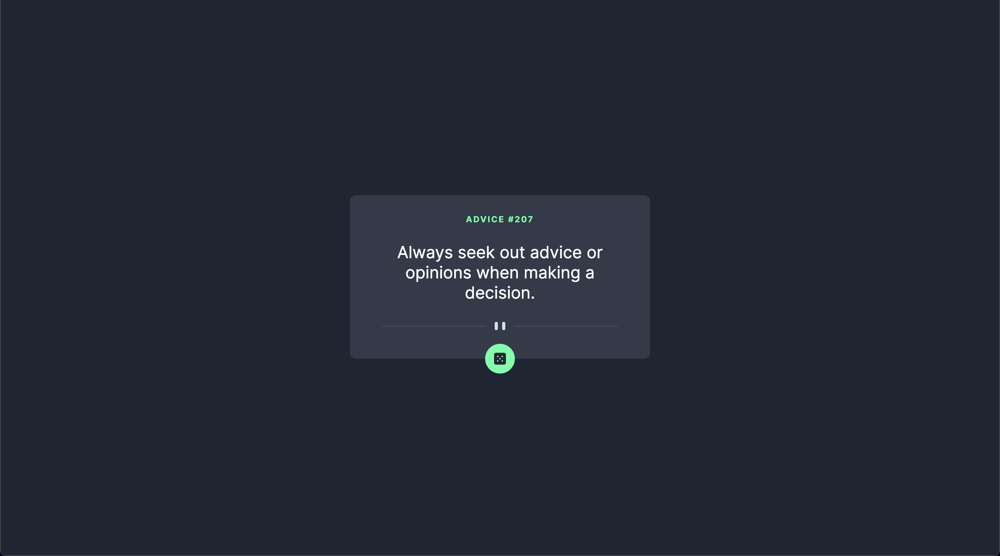

# Frontend Mentor - Advice generator app solution

This is a solution to the [Advice generator app challenge on Frontend Mentor](https://www.frontendmentor.io/challenges/advice-generator-app-QdUG-13db). Frontend Mentor challenges help you improve your coding skills by building realistic projects.

## Table of contents

- [Overview](#overview)
  - [The challenge](#the-challenge)
  - [Screenshot](#screenshot)
  - [Links](#links)
- [My process](#my-process)
  - [Built with](#built-with)
- [Author](#author)

**Note: Delete this note and update the table of contents based on what sections you keep.**

## Overview

### The challenge

Your challenge is to build out this advice generator app using the Advice Slip API and get it looking as close to the design as possible.

You can use any tools you like to help you complete the challenge. So if you've got something you'd like to practice, feel free to give it a go.

Your users should be able to:

View the optimal layout for the app depending on their device's screen size
See hover states for all interactive elements on the page
Generate a new piece of advice by clicking the dice icon
Download the project and go through the README.md file. This will provide further details about the project and help you get set up.

Want some support on the challenge? Join our Slack community and ask questions in the help channel.

### Screenshot

### Links

- Solution URL: [GitHub](https://github.com/devtarun/advice-app)
- Live Site URL: [Demo](https://god-advice-app.netlify.app/)

## My process

### Built with

- SCSS custom properties
- Flexbox
- Mobile-first workflow
- [React](https://reactjs.org/) - JS library

## Author

- GitHub - [Tarun](https://github.com/devtarun)
- Frontend Mentor - [@devtarun](https://www.frontendmentor.io/profile/devtarun)
